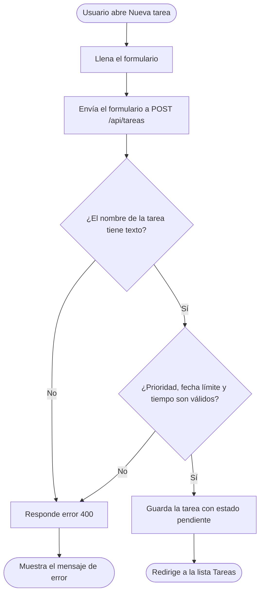
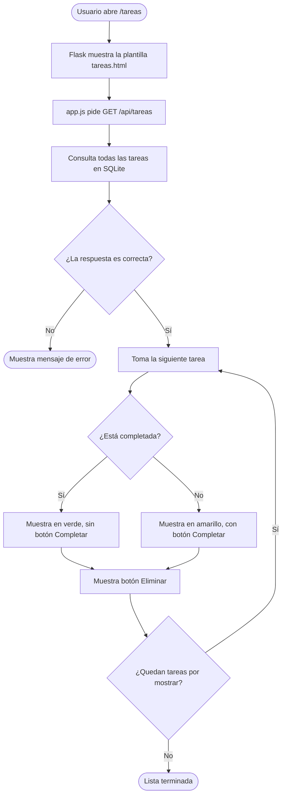
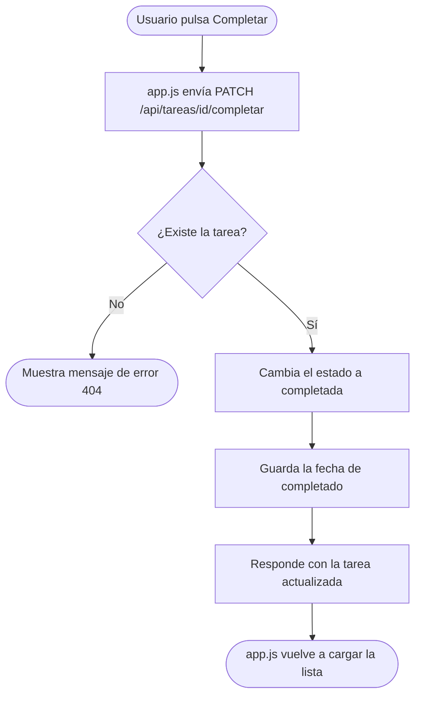

# Algoritmos de gestión de tareas

Diagramas de flujo de las operaciones del CRUD de Rutina.py: agregar, listar, actualizar y eliminar.

## 1. Agregar tarea

## 2. Listar tareas

## 3. Actualizar tarea (completar)

## 4. Eliminar tarea

```mermaid
flowchart TD
    A([Usuario pulsa Eliminar]) --> B[app.js envía DELETE /api/tareas/id]
    B --> C{¿Existe la tarea?}
    C -- No --> D([Muestra mensaje de error 404])
    C -- Sí --> E[Borra la tarea de SQLite]
    E --> F[Responde Tarea eliminada]
    F --> G([app.js vuelve a cargar la lista])
```

