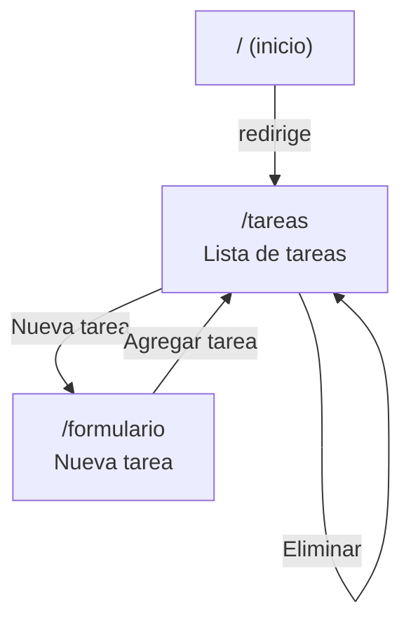

# Mapa de sitio y estructura visual de Rutina.py

## Mapa de sitio



## Wireframes

### Pantalla Tareas (`/tareas`)

```
+--------------------------------------------------------+
| rutina.py        [Tareas]  [Nueva tarea]               |
+--------------------------------------------------------+
| Tareas                                                 |
| Estas son las tareas que tienes que hacer:            |
|                                                        |
| +----------------------------------------------------+ |
| | Nombre de la tarea  [categoria] [prioridad]        | |
| | Límite: fecha · Estimado: minutos                  | |
| |                          [Completar] [Eliminar]    | |
| +----------------------------------------------------+ |
| | ...                                                | |
| +----------------------------------------------------+ |
+--------------------------------------------------------+
```

### Pantalla Nueva tarea (`/formulario`)

```
+--------------------------------------------------------+
| rutina.py        [Tareas]  [Nueva tarea]               |
+--------------------------------------------------------+
| Nueva tarea                                            |
|                                                        |
| Nombre de la tarea      [______________________]       |
| Categoría               [Selecciona o crea]            |
|                                                        |
| Prioridad [media v]  Fecha límite [__/__/____]         |
| Tiempo estimado (minutos) [____]                       |
|                                                        |
| [Agregar tarea]                                        |
+--------------------------------------------------------+
```
